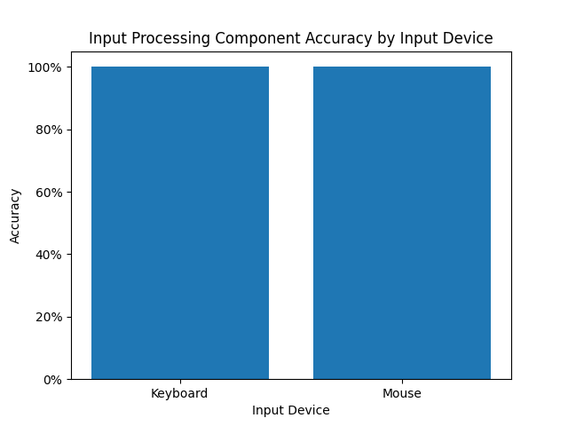

<!-- Daly says that the instructions to build are buried in paragraphs which doesn't seem true to me since I feel the direction are clear on how to build it and the steps are listed in order. Thus I believe he may be talking about the `Dependencies` section. So I will update the `Dependencies` section to make it more clear. It will likely go right before the `Build and Run` section -->

<!-- TODO: Mention how to generate the chart -->

# Logos.Input

## Overview
Logos.Input is a free and open-source C# library which provides developers with high-level components to create their own platform agnostic input processing systems. It acts as an abstraction layer that sits between an underlying low-level input library (such as [Simple DirectMedia Layer](https://github.com/libsdl-org/SDL/releases)) and application code. The library is designed to be highly modular, allowing developers to pick and choose which components to include in their input processing system.
Unlike many other input processing libraries, Logos.Input supports mapping of inputs to generic actions and values allowing developers to work with devices that may not be fully recognized by the underlying input layer. Logos.Input also comes with support for customizable control schemes, all while remaining usable across any environment supported by that underlying input layer.

Developers looking for an event-driven, platform-agnostic, and high-level input library should consider using Logos.Input.

## Features
- Platform-agnostic abstraction over low-level input libraries
- Modular input system design
- Keyboard and mouse support
- Event-driven input handling
- Input mapping to generic actions/values
- Customizable control schemes

## Performance / Accuracy
Unit tests have been performed to measure the accuracy of our library with currently supported devices (mouse and keyboard), using the SDL3 library:




## Installation
### Dependencies
#### [.NET 10 SDK](https://dotnet.microsoft.com/en-us/download/dotnet/10.0)
- Includes the C# compiler and build tools required to build and run the project.
- Download: https://dotnet.microsoft.com/en-us/download/dotnet/10.0

#### [Simple DirectMedia Layer](https://github.com/libsdl-org/SDL/releases) (LTS)
- Precompiled binaries are included for:
    - Windows x64
    - Mac OS X arm64
- For other platforms:
    - Build SDL3 from source: https://github.com/libsdl-org/SDL/releases
    - Manually copy the compiled binaries to the build output folder

#### [NUnit](https://nunit.org/download/) (LTS)
- Used for Unit Testing
- Install via:
    - NuGet (recommended) in IDEs like Visual Studio or JetBrains Rider
    - Or download from https://nunit.org/download/ and build from source

#### [Python 3.9 or later](https://www.python.org/downloads/)
- Required to generate the accuracy chart
- Install required packages:
```bash
$ pip install pandas matplotlib
```

*Note: The precompiled SDL Binaries can be found within the Libraries folder. Platform-specific binaries included in this repository will be automatically copied to the build output folder when the solution is built.*

### Build and Run

The entire source code can be found in this GitHub repository. To build the source code:

1. Clone the repository: `git clone https://github.com/COMP-4120-Logos-Input/Logos.Input.git`
2. Open the solution in your favorite IDE or code editor (make sure that you have .NET 10 and C# build tools installed).
3. Build the solution using either the Debug or Release configuration.

Alternatively, you may build the solution from the command line using the `dotnet build` command. See Microsoft's [documentation](https://learn.microsoft.com/en-us/dotnet/core/tools/dotnet-build) for more information.

## Running The Unit Tests

You can build and run the unit tests within your IDE or code editor of choice using their respective testing features. Alternatively, you can use the `dotnet test` command within the command line to build and run the unit tests. See Microsoft's [documentation](https://learn.microsoft.com/en-us/dotnet/core/tools/dotnet-test) for more information.

Automated tests operate on simulated inputs generated using SDL3, which test the functionality of input processing components in a controlled setting. Manual tests (annotated with the `[Explicit]` attribute in the source code) do not run as part of the automated test suite, but can be run individually to test how components react to inputs from physical devices. Currently, we are resolving issues with the manual tests that prevent them from working properly, but the automated tests should be able to pass or fail in a consistent manner.

## Generating the Accuracy Chart
1. Navigate to the root of the project directory which contains folders such as `Libraries`, `Scripts`, `Source`, `Tests` etc.
2. In the terminal, run the following Python script:
```bash
$ python Scripts/results.py
```
3. The project will rebuild itself, and the Python script will automatically open a chart displaying the results of the unit tests. These results can be downloaded and saved anywhere on the computer by clicking the `Save the figure` button on the taskbar.

<!-- Should we keep this? -->
## Folder Layout

* **Libraries:** Stores precompiled native libraries that Logos.Input depends on, but cannot be built using C# build tools.
* **Source:** Stores implementation of input processing components provided by Logos.Input, including extensions for SDL3.
* **Tests:** Stores unit tests that verify the functionality of input processing components provided by Logos.Input.

## Logos.Input in Action

We have assembled a few tutorials integrating our library with the Godot Engine and the GLFW input library which can be viewed in the GitHub repositories below:

### Godot Integration
https://github.com/COMP-4120-Logos-Input/Godot-Demo

### GLFW Integration
https://github.com/COMP-4120-Logos-Input/GLFW-Demo